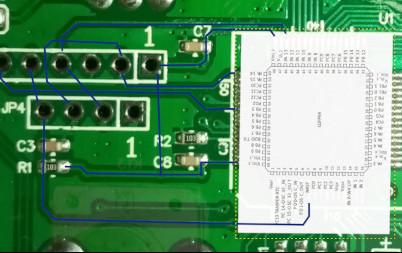

# Arturia Minilab reverse engineering experiments

During the development of [my side project](https://github.com/mhugo/noisyq/), I've been eager to hack the MIDI controller I own, an Arturia Minilab mkII.

Using the [Arturia MIDI Control Center](https://www.arturia.com/technology/mcc) (under Windows !), I first [reverse-engineered](https://github.com/mhugo/sysex) the different kinds of MIDI messages that controller sends and reacts to.

However, that led me to a frustation: I would like to know when the Shift key is pressed with one of the 8 pads. Most of the interactions on the controller sends a MIDI message: press and release of the Shift key sends a dedicated SysEx message for instance. However, the combination Shift+Pad is hardwired to a midi channel change that does not send any MIDI message. I find it very limiting.

Another frustrating limitation is that it is not possible to know the current octave the controller is set to.

That is of course a good excuse to try to know a bit more about this controller:
- is there an undocumented MIDI sysex message that would expose the current octave, or even one to set it ?
- is there a way the Shift+Pad behaviour can be changed ?

## Firmware disassembling

The MIDI Control Center is able to update the controller with a new firmware. It means there might be a way to dump the firmware and see how it works by disassembling it.

Firmwares can be found on the Arturia website under the [Downloads and Manuals section](https://www.arturia.com/support/downloads-manuals).

Firmware updates are distributed as `.led` files that are text files that contain raw hex-encoded bytes.

It turns out converting these hex strings into binary looks like binary code for an ARM32 processor !

I initially struggle a bit with Ghidra to find how to read these files. While the disassembly looked globally ok, addresses of data or code seemed a bit odd a first sight, and the disassembly was meaningless.

After some struggling, I found [someone else on the Internet](https://dsgruss.com/notes/2020/10/02/keystep1.html) has done something quite similar on another Arturia controller. His blog post has been very useful ! He figured out what I did not about the odd addresses during disassembling: the firmware files not only contain raw code, but also some "headers" and checksums. So there is a small post processing to do in order to have aligned addresses during disassembling.

TODO: explain Ghidra / SVD, etc.

## Live debugging

[In the past](https://ternet.fr/gdb_real_mode.html), I've used two "attack vectors" in complement to succeed in a reverse engineering effort: both the static code analysis via disassembling and a live debugging session while interacting with the system to reverse.

I also tried this approach of live debugging here. I know ARM processors has an integrated support for debugging through a JTAG/SWD interface. I was curious about how it works.

### Identifying the debug ports

Once the controller has been opened, a quick look at the PCB allows one to identify two suspicious ranges of connectors close to the microcontroller.

They look like JTAG or SWD connectors. But how to confirm this hypothesis ?

I've used the camera of my phone and some manpulation of GIMP to confirm it. It also allowed me to get the exact wiring of these connectors.

I took a picture of the front PCB and one picture of the back side of the PCB. I then aligned them in GIMP as two layers and played with layer opacity to switch from one side to the other and follow circuit connections.



It turns out the JP4 connector has 4 wires than are connected to the PA13, PA14 and nRST pins of the microcontroller. According to the STM32F103 documentation it corresponds to SWCLK, SWDIO and Reset with the following wiring:

```
JP4
o o o o
| | | |
| | | GND
| | SWDIO
| SWCLK
nRST
```

### Plugging wires in the debug ports

I then needed to plug a JTAG/SWD probe in the connectors I have just discovered.

I do not have dedicated connectors of this type. So I finally chose to solder jumper wires (a.k.a. Dupont wires) directly onto the board. My soldering skills are quite limited, but this turned out to be ok.


I then drilled in hole in the plastic cover of the controller so that I could close the cover and still have the wires available.


### Using a custom probe

I do not possess a proper JTAG or SWD physical probe. This led me to consider open source alternatives, especially [OpenOCD](https://openocd.org/).

This piece of software allows one to use all sort of JTAG probes, including very generic ones made through custom wiring.
It took me a little time to figure out the documentation but I came out with the following setup:
- nRST, SWCLK and SWDIO connected to GPIO2, GPIO3 and GPIO4 of a Raspberry board
- OpenOCD installed on the Raspberry PI,
- GDB for ARM installed on My laptop,
- My laptop connected to the Raspberry through ssh

The Raspberry PI was the only device with GPIOs that I had at this moment. But I am pretty sure lots of very generic devices may be used (like anything on USB with an FTDI chip)

I've used the [following configuration file](openocd.cfg) for OpenOCD, that relies on generic GPIO (linuxgpiod):
```
# 
# GPIO2 = nRST, offset 2
# GPIO3 = SWCLK, offset 3
# GPIO4 = SWDIO, offset 4

adapter driver linuxgpiod

adapter gpio swclk 3 -chip 0
adapter gpio swdio 4 -chip 0
adapter gpio srst 2 -chip 0

reset_config srst_only

transport select swd
```

In order to launch OpenOCD, in addition to the previous configuration that sets the "adapter" part, i.e. describe how to use the JTAG/SWD probe, it is also needed to give it the type of target we want to debug. The target (STM321F) is already known by OpenOCD. The invocation is then:

```
root@raspberrypi:/home/hugo# openocd -f openocd.cfg -f /usr/share/openocd/scripts/target/stm32f1x.cfg
Open On-Chip Debugger 0.12.0
Licensed under GNU GPL v2
For bug reports, read
	http://openocd.org/doc/doxygen/bugs.html
swd
Info : Listening on port 6666 for tcl connections
Info : Listening on port 4444 for telnet connections
Info : Linux GPIOD JTAG/SWD bitbang driver
Info : This adapter doesn't support configurable speed
Info : SWD DPIDR 0x1ba01477
Info : [stm32f1x.cpu] Cortex-M3 r1p1 processor detected
Info : [stm32f1x.cpu] target has 6 breakpoints, 4 watchpoints
Info : starting gdb server for stm32f1x.cpu on 3333
Info : Listening on port 3333 for gdb connections
```

The previous output means OpenOCD managed to communicate with the CPU and recognized it ! OpenOCD creates a GDB server than can then be used by gdb to connect to it and debug the running code step by step, put breakpoints, etc.

However I quickly came across a strange behaviour:
```
(gdb) target ext localhost:3333
Remote debugging using localhost:3333
warning: No executable has been specified and target does not support
determining executable automatically.  Try using the "file" command.

Program stopped.
0x08001244 in ?? ()
(gdb) 
```

And in OpenOCD logs:
```
```
Info : accepting 'gdb' connection on tcp/3333
Info : device id = 0x20036410
Info : SWD DPIDR 0x1ba01477
Error: Failed to read memory at 0x1ffff7e2
Warn : STM32 flash size failed, probe inaccurate - assuming 128k flash
Info : flash size = 128 KiB
undefined debug reason 8 - target needs reset
Info : SWD DPIDR 0x1ba01477
Error: Failed to read memory at 0x08001248
Info : SWD DPIDR 0x1ba01477
Error: Failed to read memory at 0x08001246
```

I then triple checked my wire connections. But the fact that a communication is well established with the CPU but that the memory fails to read is hard to understand.
I also tested that I was able to read other memory regions:

```
(gdb) x 0xE0042000
0xe0042000:	0x20036410
```

So ... it certainly means the flash memory cannot be read. And it seems this STM32 MCU (as well as lots of others) has a "Readout Protection" mode where the flash memory can be protected against read attempts while in debug mode ...

The "live debugging" approach is then a failure ... I am back to trying to figure out how things work with Ghidra.
